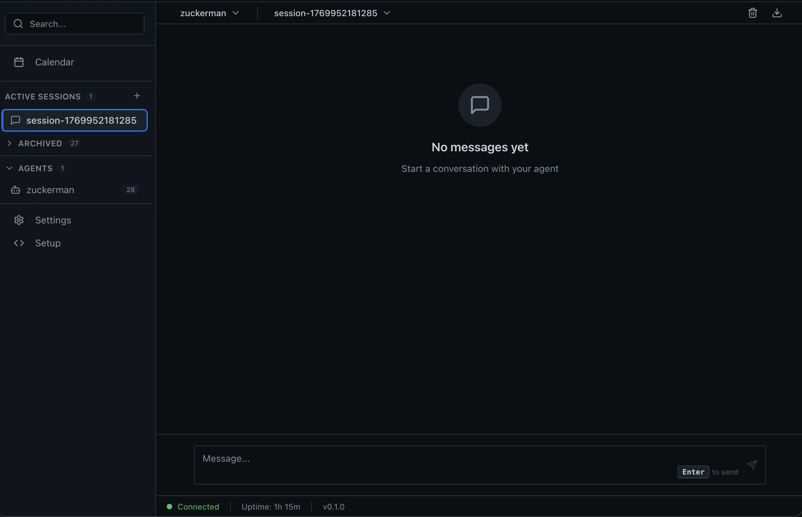

<div align="center">
  
  <h1>Zuckerman [WIP]</h1>
</div>

**Ultra-minimal personal AI: starts small, self-modifies its code live, adapts by writing exactly the code & features you need (beyond just self-looping), improves instantly, and shares improvements with other agents.**

The vision: Build a truly self-growing intelligence — one that can add tools, rewrite behavior, or extend its core logic by editing its own files — with almost no external code required. Agents propose and publish capabilities to a shared contribution site, letting others discover, adopt, and evolve them further. A collaborative, living ecosystem of personal AIs.

<div align="center">
  
</div>

## Why Zuckerman Exists

OpenClaw exploded in popularity (100k+ GitHub stars in weeks) because it delivers real agentic power: it acts across your apps, remembers context, and gets things done. But that power comes with trade-offs — massive codebase, complex setup, steep learning curve, ongoing security discussions (prompt injection, privileged access), and constant updates that can overwhelm regular users.

Zuckerman takes the opposite path:

- **Ultra-minimal start** — only the essentials, zero bloat
- **Full self-edit power** — the agent can modify **its own configuration, tools, prompts, personalities, and even core logic** in plain text files
- **Instant evolution** — changes hot-reload immediately (no rebuilds, restarts, or dev friction)
- **Collaborative growth** — agents share useful edits/discoveries so the whole network levels up together

You get an approachable, customizable agent that literally grows by rewriting itself — powerful without the usual headaches.

## Key Features

- **Minimal by design** — starts with core essentials only
- **Real-time self-improvement** — agent edits its own files (config, tools, behavior, code) and reloads instantly
- **Full runtime modification** — tweak anything while the agent runs
- **Hot-reload everywhere** — no restarts needed
- **Feature versioning** — track and manage versions of agent capabilities and improvements
- **Collaborative ecosystem** — share and adopt improvements via a contribution website
- **Multi-channel ready** — Discord, Slack, Telegram, WhatsApp, WebChat + more
- **Voice support** — TTS/STT with multiple providers
- **Security foundations** — auth, policy engine, sandboxing (Docker), secret management
- **Multiple agents** — run several with unique personalities/tools
- **Dual interfaces** — CLI (power users) + Electron app (visual)
- **Calendar & scheduling** — built-in time management

## Architecture (Three Layers)

Everything is plain-text configurable and instantly reloadable.

- **World** (`src/world/`) — the lightweight OS layer  
  Communication (messengers, gateway), Execution (processes, security), Runtime (agent factory), Config loader, Voice, System utils

- **Agents** (`src/agents/`) — self-contained agent definitions  
  Each folder = one agent (core modules, tools, sessions, personality)

- **Interfaces** (`src/interfaces/`) — how you talk to it  
  CLI + Electron/React app (chat, inspector, settings, onboarding)

## Quick Start

```bash
# Clone and install
git clone https://github.com/zuckermanai/zuckerman.git
cd zuckerman
pnpm install

# Launch the Electron app (recommended for beginners)
pnpm run dev
